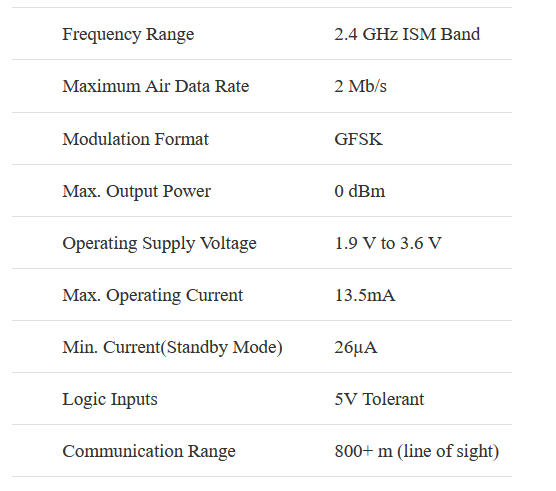
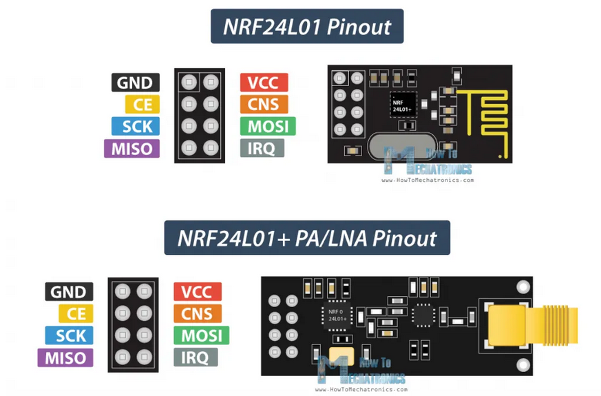
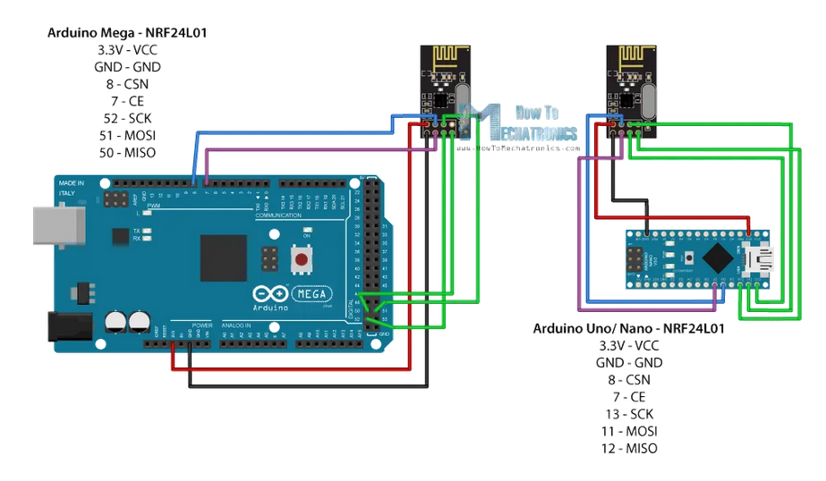

# Afstandbeheer Arduino

Hierdie tutoriaal word net gebruik om die kommunikasie protokol te toets.  Dit word nog nie gebruik om die afstandbeheer te bou nie.

Dit is 'n "Hallo world" program.


## Kooplys:

2 x NANO 5V 16MHz - CH340 USB Chipset - Compatible with Arduino®

https://www.robotics.org.za/NANO-CH340?search=arduino%20nano

2 x NRF24L01 RF + Antenna  Module

https://www.robotics.org.za/NRF24L01-ANT?search=nrf

Spesifikasie:




## Kode vir "Hallo World"

Die volgende tutoriaal is gebruik vir die program.

https://howtomechatronics.com/tutorials/arduino/arduino-wireless-communication-nrf24l01-tutorial/

Dit het die volgende stroombaan:






### Probleme

Die program het nie die eerste keer gewerk nie.  Die radios het dalk nie kommunikeer nie en gevolglik was daar geen boodskap op die seriale monitor wat "Hallo world" gesê het nie.  Dit is moontlik te wyte aan die volgende:

- Die antennas was reg langs die wifi wat ook die 2.4GHz frekwensie gebruik
- Die stroombane het nie die aanbevole 10$\mu F$ kapasitor op die kraglyn gehad nie.  Dus kon die kragsein raserig gewees het, a.g.v. die nano borde wat in die laptop ingeprop was
- Die een nano bord was in die skootrekenaar geprop en die ander in 'n rekenaar.  Dit het dus nie onafhanklike kragbronne gehad nie.  Die geraas van die kragbronne kon die oorsaak van die seinprobleem wees. Opdatering op 2022-08-01:  Die een nano is in skootrekenaar ingeprop en ander by huis rekenaar en dit het nie die probleem opgelos nie.  Dit was nie dit nie.
- Die kragvoorsiening vanaf die Arduino nano mag dalk nie genoegsaam wees nie.  Doen 'n toets met die radio ingeprop in 'n Arduino Uno en kyk of dit meer krag kan voorsien.  Andersins gee die radio sy eie kragbron vanaf 'n battery met die kapasitor installeer.

*Korrektiewe aksie:*

- Volg die raad op die volgende forum:  https://forum.arduino.cc/t/how-to-change-nrf24l01-frequency-channel/356550/21.  HIerdie forum was nie so nuttig nie, in terugskouing.

- Sit if (radio.available()) stelling in om te kyk of die radio nie werk nie:

``` C++
   if (radio.available()){
     bool done = false;    
     while (!done){
       done = radio.read(msg, 1);      
       Serial.println(msg[0]);
       if (msg[0] == 111){delay(10);digitalWrite(LED1, HIGH);}
       else {digitalWrite(LED1, LOW);}
       delay(10);}}
   else{Serial.println("No radio available");}
```

-   Probeer ander nommer kanaal om die radio sein oor te stuur, dit kan moontlik die sein op 'n ander frekwensie sit en dan sal dit nie inmeng met wifi nie.  Verander die kanaal deur die ```radio.setChannel(125);``` opdrag te gebruik soos in die volgende forum:  https://arduino.stackexchange.com/questions/79452/nrf24l01-channel-switching To prevent these signals from causing issues, we suggest using the **highest 25 channels** your nRF24L01+ module. Reason for this is WiFi uses most of the lower channels. (From https://lastminuteengineers.com/nrf24l01-arduino-wireless-communication/) -> 2022-08-02:  Het hierdie probeer, dit het nie gewerk nie.
-   Sit 10$\mu F$ kapasitor in om geraas op kraglyn te filter  -> 2022-08-02:  Het hierdie probeer, dit het nie gewerk nie.  Die kapasitor was moontlik ook te ver van die sender en/of die 3.3V lyn van die Arduino het nie genoegsame stroom gelewer nie.


-   Sit elke nano op sy eie 3V battery

https://youtu.be/aztm_8qGVfc 

Volgens bogenoemde is Nano is nie sterk genoeg nie moet ekstern krag gee met regulator (spanningsreguleerder).


-   Vanaf https://www.arrow.com/en/research-and-events/articles/arduino-rf-communication-tutorial-with-nrf24l01-plus :  You can try a few software tricks to improve range as well,  referenced in the setup function of both Arduino code examples. Power  levels are defined by the radio.setPALevel(), and vary between  RF24_PA_MIN, RF24_PA_LOW, RF24_PA_HIGH, and RF24_PA_max.    -> 2022-08-02:  Het hierdie probeer, dit het nie gewerk nie.  Het dit op RF24_PA_MIN gesit.
-   Set the data rates with the radio.setDataRate() function.  RF24_250KBPS signifies 250 kbps, which is the slowest speed available  and it offers the longest range of data transmission. RF24_1MBPS  signifies 1Mbps and RF24_2MBPS signifies 2 Mbps, giving a higher  transfer speed, but less range.  Lower the datarate for better communication   -> 2022-08-02:  Het hierdie probeer, dit het nie gewerk nie.  Het dit op die 250KBPS gehad.
-   You can also set the channel of your radio between 2.400 and 2.524 GHz using the radio.setChannel(). At that reading, values of  0-124 correspond to 2.4 GHz plus the channel number in units of MHz. So  radio.setChannel(21). Your radio will therefore communicate at 2.421  GHz. While this is a bit more nebulous speed-wise, different channels  will certainly give better performance depending on your surrounding  environment. Note that 2.483.5 GHz is normally the top legal limit for  this type of transmission, so be sure to keep that in mind.   -> 2022-08-02:  Het hierdie probeer, dit het nie gewerk nie.  Het dit op kanaal 124 gehad om dit op ander frekwensie as WiFi te sit.
-   Stel die krag vlak van die RF24 na minimum soos in volgende tutoriaal:  https://www.youtube.com/watch?v=57pdX6b0sfw en sit die datatempo na die laagste instelling:
``` C++
radio.setPALevel(RF24_PA_MIN);
radio.setDataRate(RF24_250KBPS);
```
  -> 2022-08-02:  Het hierdie probeer, dit het nie gewerk nie.  

-   Gee die RF24 module krag van af die groter Arduinos (Leonardo en Uno).   -> 2022-08-02:  Het hierdie probeer, dit het nie gewerk nie.  

- Koop volgende module om meer krag aan die senders te gee:  NRF24L01 RF 2.4 GHz 5.5V-3.3V Regulator Base Module.  Dit het ingeboude kapasitore en spanningsreguleerders.  Kan tot 12V vir hierdie basis module gee en dit sal werk.  -> 2022-0809:  Dit het amper gewerk, maar daar is nog baie geraas en dit werk net as jy aan die drade vat, dan werk dit partykeer.


Electronoob se kanaal het raad gegee op die volgende video:
https://www.youtube.com/watch?v=Z7_Cy66Vnrc
Dit word as volg opgesom:
- Hou drade kort, want dit beperk SPI geraas op die seine.  Dit is induseerde geraas oor drade en NIE die geraas van die 2.4GHz radio sein nie.  Hou die drade weg van kragdrade.   Kon dit agterkom, want as jy drade op sekere manier vashou begin dit werk.
- Sit sender in 'n Faraday hok.  Dit skerm EMI af.
- Draai die GND (grond) draad rondom die MOSI en MISO drade om geraas te voorkom.  MOSI en MISO is die SPI (serial peripheral interface) drade.  Draai die gronddrade daarom.


Die volgende video het ook raad gehad oor die sagteware instellings van goedkoper senders:
https://www.youtube.com/watch?v=jfaFbjgwprI


Hier is die detail dokumentasie vir die RF24 library:

https://nrf24.github.io/RF24/classRF24.html#ab6a711a9cc14fb459a4a1698b8665d82


## Tutoriale vir vliegtuig afstandbeheer

Gebruik hierdie tutorial om die remote te bou:

https://youtu.be/7rcVeFFHcFM

Dit word in hierdie vliegtuig gebruik:

https://youtu.be/bD7rQbnSbek

