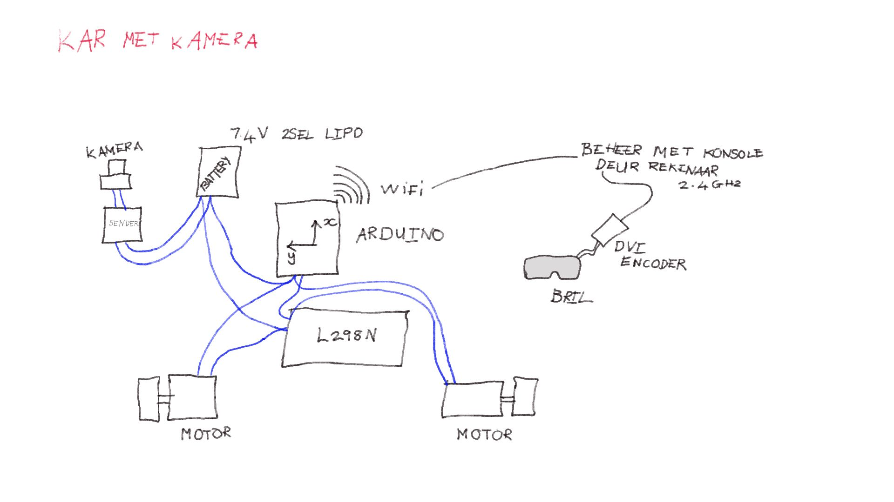
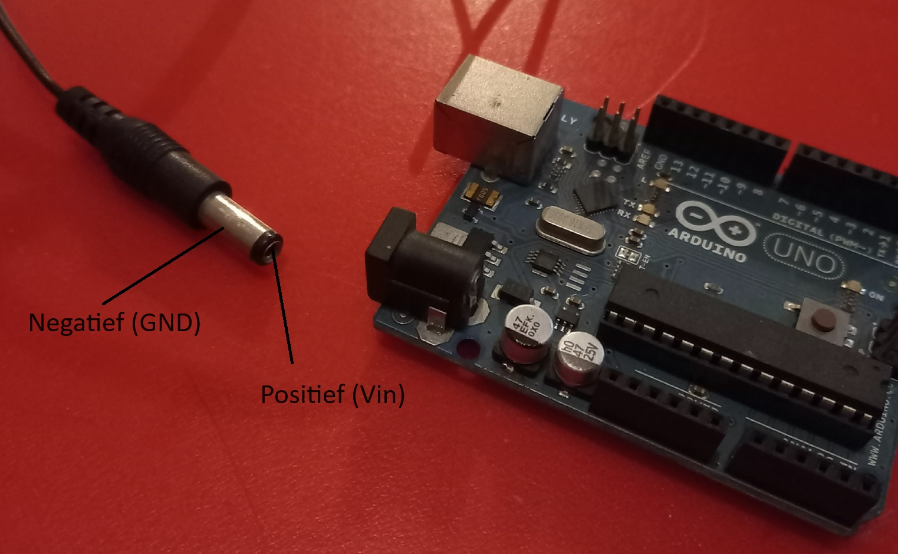
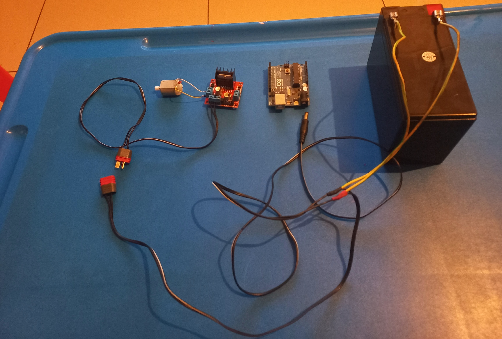
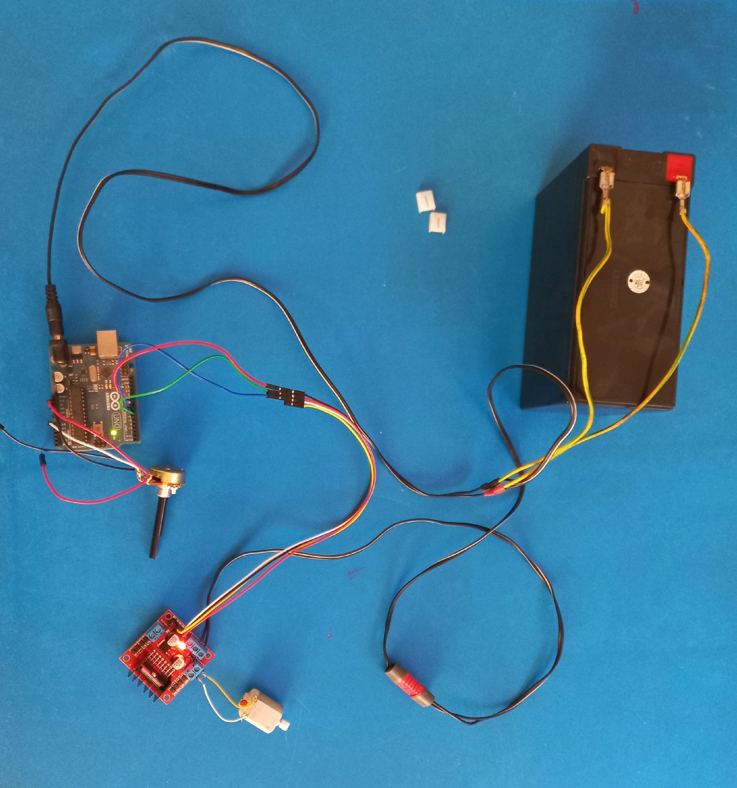

# Radio beheer kar met kamera

Bou 'n radiobeheer kar met die Fat Shark kamera op.




## Bron

Gebruik die volgende bron vir die stroombaan:

https://howtomechatronics.com/tutorials/arduino/arduino-dc-motor-control-tutorial-l298n-pwm-h-bridge/


## Statiese IP adres

Stel statiese IP adres op met volgende kode

```
WiFiNINA - WiFi.config()
```


https://www.arduino.cc/reference/en/libraries/wifinina/wifi.config/

Voorbeeld:

```
// the IP address for the shield:
IPAddress ip(192, 168, 0, 177);

WiFi.config(ip);
```


## Nuttige inligting vir die projek

Die middelste kontak (centre pin) van die ronde konneksie (barrel jack connector) is positief vir die Arduino.  Die buitenste wand (tube) is negatief.

Die grond of negatief van die ronde konneksie is gekoppel aan GND op die Arduino.



## Arduino sketse

| Skets | Beskrywing |
| ----- | ----- |
| karMotorBeheer | Beheer die motor met die L298 motorbeheerder.  Toets skets vir die motorbeheer. |
| karWifi | Stuur boodskappe met UDP protokol na Arduino.  Dit is ontwikkeling vir die afstandbeheer van die kar. |

## Projek vordering

2023-11-14:  Maak 'n kabel wat die Arduino van 'n 12V battery aandryf en die L298 motordrywer ook van 12V verskaf.
Die L298 is van 'n afsonderlike kragprop voorsien sodat dit in en uitgeprop kan word.
Die Arduino word met 'n ronde prop van krag voorsien.



2023-11-19:  Koppel die L298N met 'n reostaat en die Arduino en 'n motor.  Motor kan beheer word deur reostaat.  Die kortsluiting (jumper) by ENA op die L298N was verwyder om spoedbeheer te kan doen.  Die motor was te klein vir die volle 12V, dit is eintlik 'n motor wat vir 5V geskik is.  Die toetsMotorAlleen.ino skets is gebruik hiervoor.




