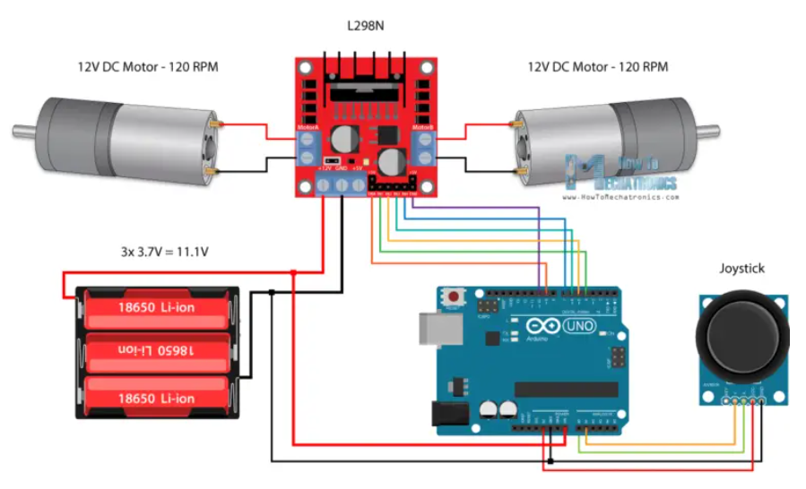

# Radio beheer kar met kamera

Bou 'n radiobeheer kar met die Fat Shark kamera op.


## Bron

Gebruik die volgende bron vir die stroombaan:

https://howtomechatronics.com/tutorials/arduino/arduino-dc-motor-control-tutorial-l298n-pwm-h-bridge/



## Statiese IP adres

Stel statiese IP adres op met volgende kode

```
WiFiNINA - WiFi.config()
```


https://www.arduino.cc/reference/en/libraries/wifinina/wifi.config/

Voorbeeld:

```
// the IP address for the shield:
IPAddress ip(192, 168, 0, 177);

WiFi.config(ip);
```


## Nuttige inligting vir die projek

Die middelste kontak (centre pin) van die ronde konneksie (barrel jack connector) is positief vir die Arduino.  Die buitenste wand (tube) is negatief.

Die grond of negatief van die ronde konneksie is gekoppel aan GND op die Arduino.


## Arduino sketse

| Skets          | Beskrywing                               |
| -------------- | ---------------------------------------- |
| karMotorBeheer | Beheer die motor met die L298 motorbeheerder.  Toets skets vir die motorbeheer. |
| karWifi        | Stuur boodskappe met UDP protokol na Arduino.  Dit is ontwikkeling vir die afstandbeheer van die kar. |

## Projek vordering

2023-11-14:  Maak 'n kabel wat die Arduino van 'n 12V battery aandryf en die L298 motordrywer ook van 12V verskaf.
Die L298 is van 'n afsonderlike kragprop voorsien sodat dit in en uitgeprop kan word.
Die Arduino word met 'n ronde prop van krag voorsien.


2023-11-19:  Koppel die L298N met 'n reostaat en die Arduino en 'n motor.  Motor kan beheer word deur reostaat.  Die kortsluiting (jumper) by ENA op die L298N was verwyder om spoedbeheer te kan doen.  Die motor was te klein vir die volle 12V, dit is eintlik 'n motor wat vir 5V geskik is.  Die toetsMotorAlleen.ino skets is gebruik hiervoor.


<<<<<<< HEAD
2025-04-19:  Verander die detail ontwerp om eerder te werk met 'n ESP32.  Die ESP32 het 'n module om die PS3 as 'n afstandbeheer te gebruik wat met Bluetooth werk.

Die volgende skakel is gebruik vir die idee en die drywer van die ESP:

Dronebot workshop het die idee en skakels gegee:

https://dronebotworkshop.com/ps3-esp32/

Hier is die repository vir die PS3 se koppeling:

https://github.com/jvpernis/esp32-ps3

Baie belangrik:  Die PS3 repo is hele paar jaar oud.  Dus werk dit nie met die nuutste Espressif sagteware nie, dus rol die sagteware in die Boards Manager terug na 3.0.0.  Dan vertaal die skets.  Andersins werk dit nie.


Dit was hierdie ESP32:

https://www.robotics.org.za/ESP32-DEV-CH340-C?search=esp32


Die volgende laers is identifiseer en aangekoop vir die ratkas van die kar:

https://www.robotics.org.za/683ZZ


=======
2025-08-16:  Verander die projek laat die kar beheer word deur 'n ESP32.  Die afstandbeheer moet 'n PS3 remote wees.  Dit moet nog steeds opdragte deur Wifi kan ontvang.  Die ESP32 is al met 'n PS3 remote gekoppel maar nog niks is verder gedoen nie.  Gebruik die volgende artikel om dit te doen:

Onthou dat die ouer weergawe van die ESP sagteware gebruik moet word.  Anders werk die sketse nie.

https://dronebotworkshop.com/ps3-esp32/
>>>>>>> 18b5605875c4cce08679aedfdc1e394c5b7a9554
