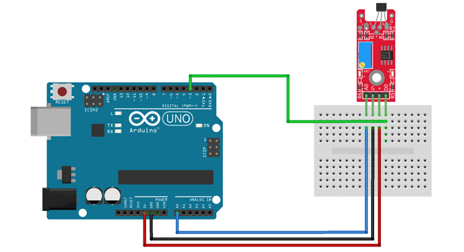

# Motor oordragfunksie uit toets

Bepaal die motor oordragfunksie vir beheerstelsel deur te toets.

Gebruik volgende artikel as riglyn:

https://ctms.engin.umich.edu/CTMS/index.php?example=MotorSpeed&section=SystemModeling

Hierdie is eenvoudiger en gebruik dit dalk eerder:

https://medium.com/@caglayanserbtci/estimate-any-dc-motor-transfer-function-2a67e3d67b20

Gebruik eerder 'n eerste orde oordragfunksie om die motor te beskryf.  Dit is eenvoudiger.
$$
\frac{\Omega(s)}{E_a (s)} = \frac{K_m}{\tau_m s + 1}
$$
waar $K_m$ die motor konstante is en $\tau_m$ die motor konstante is.  Die oordragsfunksie is omwentelingspoed per spanning of Volts.  Dus stel die motor op 'n sekere spanning bv. 3V en meet die omwentelingspoed deurlopend.  Stel nou die spanning hoër met 'n stapinset na 4V en meet die verandering in spoed.  Varieer die onbekendes om die respons te pas en bepaal so die tydkonstante.

Die bostaande frekwensie domein vergelyking word deur die volgende bewegingsvergelyking afgelei:
$$
\tau \frac{d \Omega}{dt} + \Omega = k e_i
$$
waar $\Omega$ die hoeksnelheid is in rad/s en $e_i$ die spanning is wat aangewend word.  $k$ is die gestadigde aanwins wat uitgedruk word in (rad/s)/V.

Gebruik die webwerf om die karakterisering te doen:

https://cooperrc.github.io/sensors_and_data/ME3263-Lab_06/ME3263-Lab_06BR.html

$$
T = K_m i
$$
waar $K_m$ die motor draaimoment konstante is.  Dit word uitgedruk in N.m/A.  Die draaimoment van die motor word teengewerk deur traagheid van motor en wrywing.

Kry die motor konstante deur 'n bekende massa deur 'n ratkas op te tel en die versnelling van die massa te meet.  Meet die spoed van rotasie.  Indien dit konstant is, is die draaimoment net die massa maal die hefarm, maar indien dit versnel is daar ekstra draaimoment wat deur $I \times \alpha$ bepaal kan word.

Die volgende grafiek is die normaliseerde respons vir 'n arbitrêre eerste orde stelsel.  Die punt wat die 63.2% response punt is is die plek waar $t / \tau = 1$ of $t = \tau$.  By hierdie punt het die respons 63.2% van die gestadigde waarde bereik.  Hierdie punt is 'n vinnige afskatting van die stelsel se tydkonstante.  Gebruik hierdie beginsel om die motor se tydkonstante te bepaal.

## Hall effek sensor

Gebruik 'n Hall-effek sensor om die die rotasie teen tyd data in te win:

https://www.robotics.org.za/KY-024?search=hall%20effect

Hier is die bedrading vir die Hall effek sensor:

Gebruik die skets:  HallEffek.ino

## Hall Effek toetsopstelling

Maak toetsopstelling op 2024-02-13.

Die digitale sein is raserig, soveel so dat dit die aantal kere aan en af sal verkeerd tel.  As die sensor op 'n sekere manier neergesit word, werk dit reg, maar dis moeilik herhaalbaar.  Moet dalk 'n twisted pair vir die kragdrade maak.  Hulle het moontlik 'n magneetveld wat die sensor optel.  Die lang drade in die lug is eintlik 'n bron van elektriese velde en magneetvelde.

Herhaal nou die bostaande eksperiment met die gekoopte neodymium magnete.