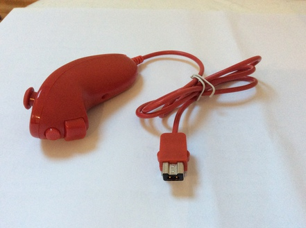
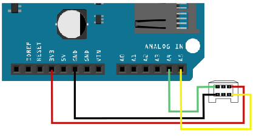
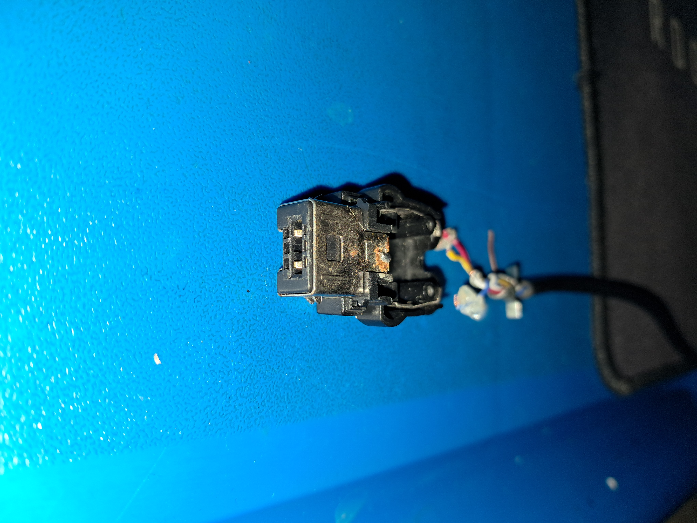
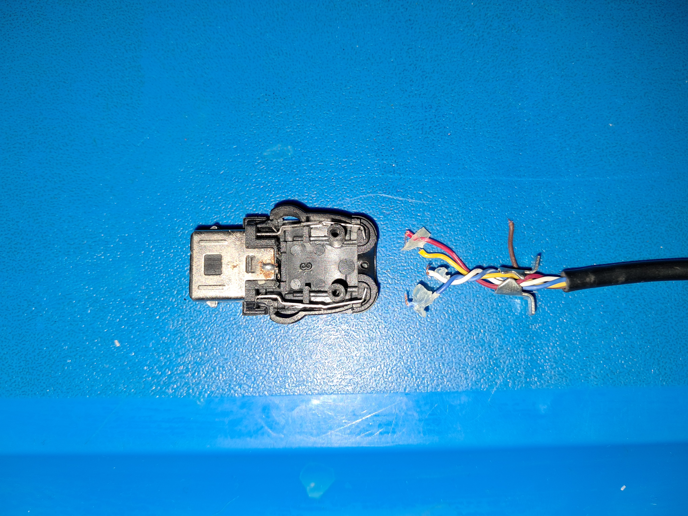
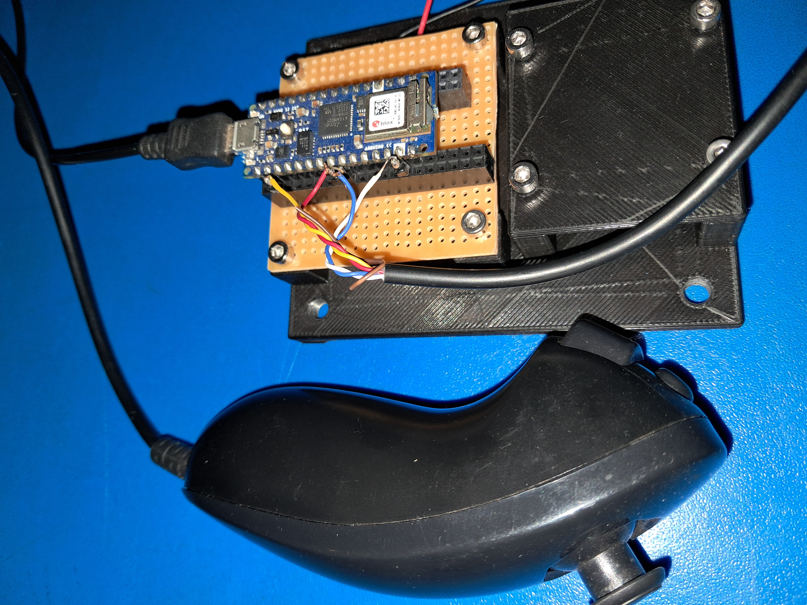
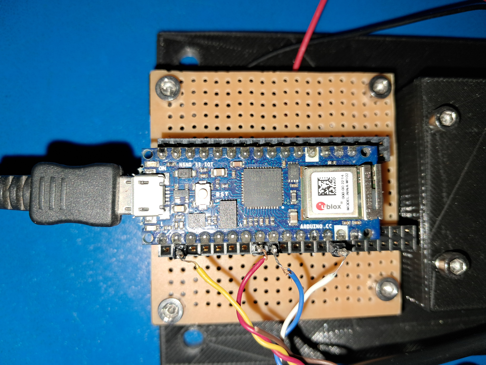

# Wii-Nunchuk

Schema
---

Documentation
---
The full documentation can be found [here](http://www.xarg.org/2016/12/using-a-wii-nunchuk-with-arduino/).

Eie nunchuk:

Dit lyk asof die drade van die nunchuk die volgende konvensie het, weens die orientasie van die drade toe dit uitgekom het.  Die drade was af, so dit was nie moontlik om die konneksie te bevestig nie.

Hier is fotos van die bestaande nunchuk, maar die drade was reeds afgebreek:

Nadat die nunchuk oopgemaak is kon die konvensie van die bord af verkry word want dit is daar gedruk op die PC bord.

    Yellow → 3v3
    Bruin → nc
    Blou → SCL of A5
    Red → SDA of A4
    nc
    White → GND

Die drade van die nunchuk is soos hierbo en in die foto gekoppel en dit het gewerk.  Die spesifieke nunchuk het 'n probleem met die joystick in die sin dat net die x-kanaal (links/regs) werk.  Die y-as of op en af is stukkend.

