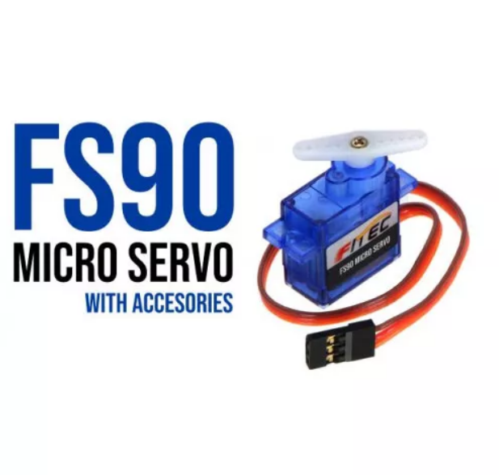

From:  https://www.robotics.org.za

Price R56.35 on 2021-10-07

# Servo, Micro 1.3kg.cm - Feetech Original

This is a great general-purpose actuator for tiny mechanisms. The  FS90 is a 9 g analog servo from FEETECH (formerly known as Fitec) that  offers position control over an approximate 120° operating angle for  servo pulses between 900 µs and 2100 µs. As with most servos, the pulse  range can be expanded to achieve an expanded operating angle, but the  limits of this are not specified by FEETECH. We have sold other generic  micro servos, but the build quality of Feetech is just so much better.  The servo include horns and fastening screws. 

# Quick Spec

Type: Micro 9g analog servo

Torque @ 6V: 1.5 kg·cm

Operating Voltage: 4.8-6 Volts

Plastic gears

Speed @ 6V:	0.10 sec/60°

Weight 9g

Size 23.2*12.5*22.0mm

