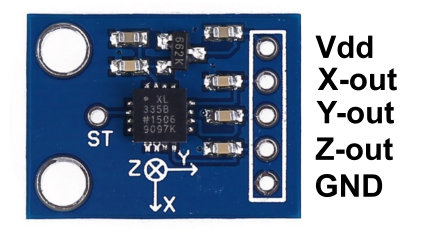
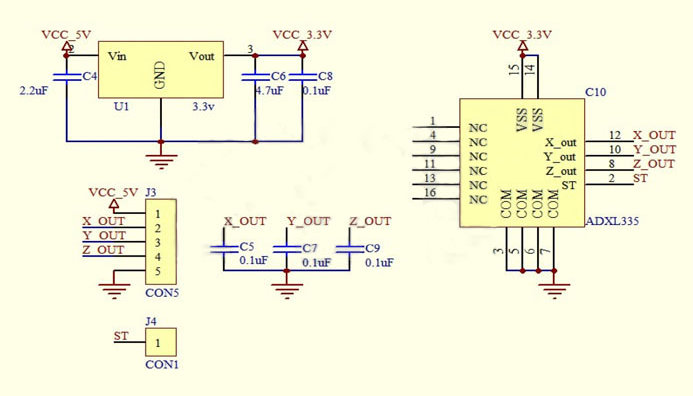
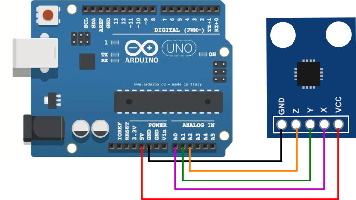

https://www.robotics.org.za

R89.70 op 2021-10-07

# ADXL335 Module Triple Axis Accelerometer Breakout

The 3 axis ADXL335 from Analog Devices is the latest in a long,  proven line of analog sensors - the holy grail of accelerometers. The  ADXL335 is a triple axis MEMS accelerometer with extremely low noise and power consumption - only 320uA! The sensor has a full sensing range of  +/-3g. The Board comes fully assembled and tested with external  components installed.

# Quick Spec

- Sensor Chip: ADXL335
- Power Supply:  1.8V- 6V  (Onboard 3.3V Regulator)
- Integrated X, Y, and Z axis accelerometer on a single chip
- X and Y axis has a 0.5Hz to 1600Hz bandwidth
- Z axis has a 0.5Hz to 550Hz bandwidth
- Hermetically sealed for temp and humidity resistance
- 10,000 g shock tolerant
- Dimensions: 21 x 16 mm

