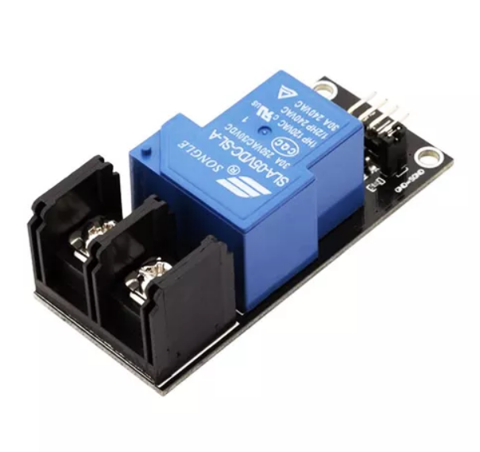
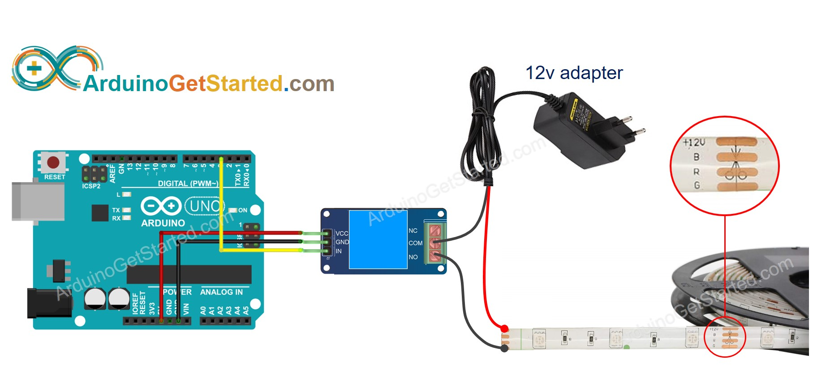

https://www.robotics.org.za

Prys:  R90.85 op 2021-10-07

https://arduinogetstarted.com/tutorials/arduino-relay#content_video

# Relay Module 1 Relay - 5V 30A

This is 1 channel Relay module, can able to control various  appliances, and other equipment with a BIG current for 30A  (250VAC/30VDC).It can be controlled directly by microcontroller:  Raspberry, Arduino, AVR, PIC, DSP, ARM or TTL logic.For control of  module need power 5V and logic operation 3.3V/5V.For isolate the  microcontroller from the relay, an optocouplerhas been added. Now with  this configuration, the microcontroller doesn’t have any physical  connection with the relay, it just uses the LED light of the Optocoupler IC to activate the relay. This solution saves your microcontroller from a high voltage for VAC/VDC.

# Quick Spec

- Power Supply: 5V
- Current: 30A
- VAC: 250V
- VDC: 30V

